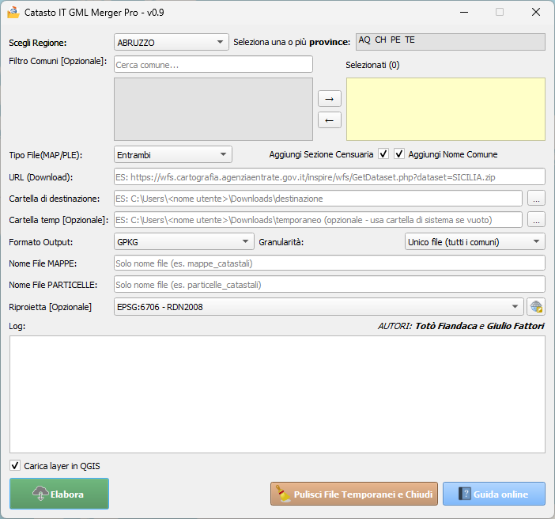

# Guida al plugin CatastoIT_GML_Merger_Pro per QGIS

## Descrizione generale
**CatastoIT_GML_Merger_Pro** è un plugin avanzato per QGIS che consente di scaricare, estrarre e unire file GML del catasto italiano. Il plugin permette di lavorare con file di mappa (MAP) e particelle (PLE), convertendoli nel formato GPKG e aggiungendo i campi foglio e particella per un'integrazione completa nei flussi di lavoro GIS.

## Funzionalità principali

1. **Download dati catastali**: Scarica automaticamente file ZIP da un URL specifico per ogni regione italiana [RNDT](https://geodati.gov.it/geoportale/visualizzazione-metadati/scheda-metadati/?uuid=age:S_0000_ITALIA)
2. **Estrazione intelligente**: Decomprime file ZIP delle province e dei comuni con gestione ottimizzata dello spazio
3. **Unione file GML**: Unisce i file GML estratti in un unico file con risoluzione automatica dei conflitti
4. **Conversione multi-formato**: Supporta l'esportazione in GPKG, SHP, GeoJSON con preservazione completa degli attributi
5. **Caricamento in QGIS**: Opzione per caricare direttamente i layer risultanti in QGIS con stile predefinito
6. **Gestione della memoria**: Ottimizzazione per la gestione di grandi volumi di dati catastali
7. **Log dettagliato**: Registrazione completa delle operazioni per controllo e debug
8. **Filtro geografico**: Possibilità di selezionare più province
9. **Report statistico**: Generazione automatica di report sui dati elaborati

## Come utilizzare il plugin

1. Avvia il plugin dall'icona nella barra degli strumenti o dal menu Plugin
2. Seleziona la regione dal menu a discesa (l'URL si aggiorna automaticamente)
3. Seleziona il tipo di file da elaborare (Mappe, Particelle o entrambi)
4. Applica eventuali filtri geografici per province specifiche
5. Scegli il formato di output desiderato (solo GPKG)
6. Definisci i percorsi dei file di output
7. Seleziona se caricare i layer risultanti in QGIS
8. Clicca su "Elabora" per avviare il processo
9. Monitora l'avanzamento attraverso i messaggi nel riquadro di log
10. Al termine, visualizza il report statistico generato automaticamente
11. Clicca su "Chiudi" per pulire le directory temporanee

## Note tecniche
- Il plugin crea directory temporanee per l'elaborazione con pulizia automatica
- La procedura include: download, estrazione, unione e filtro degli attributi
- I tempi di elaborazione vengono mostrati al termine del processo
- Gestione ottimizzata della memoria per file di grandi dimensioni

## Dati di output
- Nei file di output vengono eliminati i campi inutili e mantenuti solo `gml_id` e `ADMINISTRATIVEUNIT`
- Nei file di output vengono aggiunti campi calcolati per facilitare l'identificazione catastale
  - Campo **Foglio**: estratto automaticamente dai dati originali per rapida consultazione
  - Campo **Particella**: numero identificativo della particella catastale, elaborato dal codice originale
- La combinazione di questi campi consente ricerche e filtraggio immediato dei dati catastali
- Gli attributi originali vengono mantenuti per compatibilità con altri sistemi

## Requisiti di sistema
- QGIS 3.22 o superiore
- Connessione internet per il download dei dati
- Almeno 4GB di RAM (8GB consigliati per province estese)
- Spazio su disco sufficiente per i dati temporanei e di output
- Python 3.7 o superiore con librerie GDAL/OGR

