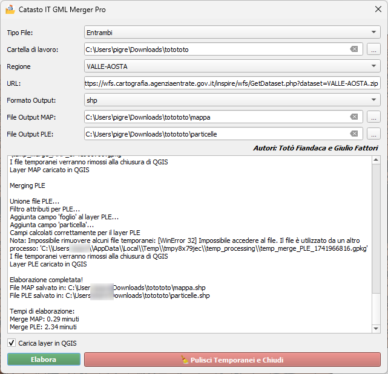

# Guida al plugin CatastoIT_GML_Merger_Pro per QGIS

## Descrizione generale
CatastoIT_GML_Merger_Pro è un plugin per QGIS che consente di scaricare, estrarre e unire file GML del catasto italiano. Il plugin permette di lavorare con file di mappa (MAP) e particelle (PLE), convertendoli in diversi formati (GML, GPKG, SHP, GeoJSON).

## Funzionalità principali

1. **Download dati catastali**: Scarica file ZIP da un URL specifico (Regioni)
2. **Estrazione automatica**: Decomprime file ZIP delle province e dei comuni
3. **Unione file GML**: Unisce i file GML estratti in un unico file
4. **Conversione formati**: Supporta l'esportazione in GML, GPKG, SHP, GeoJSON
5. **Caricamento in QGIS**: Opzione per caricare direttamente i layer risultanti in QGIS

## Come utilizzare il plugin

1. Avvia il plugin dall'icona nella barra degli strumenti o dal menu Plugin
2. Seleziona la regione dal menu a discesa (l'URL si aggiorna automaticamente)
3. Seleziona il tipo di file da elaborare (Mappe, Particelle o entrambi)
4. Scegli il formato di output desiderato
5. Definisci i percorsi dei file di output
6. Seleziona se caricare i layer risultanti in QGIS
7. Clicca su "Elabora" per avviare il processo
8. Monitora l'avanzamento attraverso i messaggi nel riquadro di log
9. Al termine, clicca su "Chiudi" per pulire le directory temporanee

## Note tecniche
- Il plugin crea directory temporanee per l'elaborazione
- La procedura include: download, estrazione, unione e filtro degli attributi
- I tempi di elaborazione vengono mostrati al termine del processo

Questa guida fornisce le informazioni essenziali per utilizzare il plugin Catasto GML Merger in QGIS.
