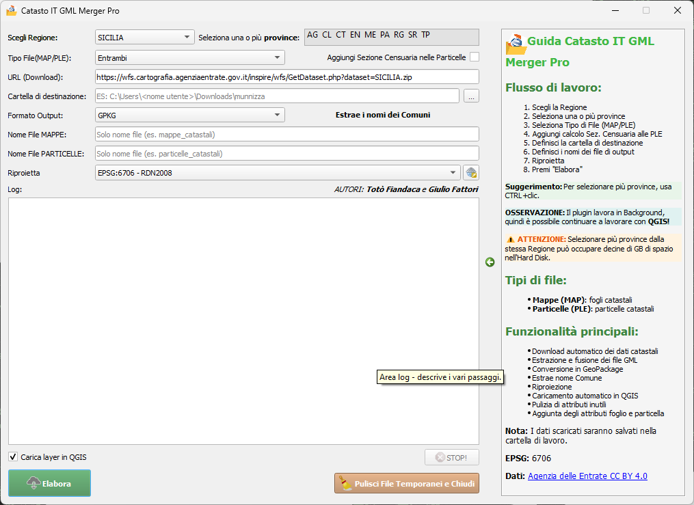

# Guida al plugin CatastoIT_GML_Merger_Pro per QGIS

## Descrizione generale
**CatastoIT_GML_Merger_Pro** è un plugin avanzato per QGIS che consente di scaricare, estrarre e unire file GML del catasto italiano. Il plugin permette di lavorare con file di mappa (MAP) e particelle (PLE), convertendoli nel formato GPKG e aggiungendo i campi foglio e particella per un'integrazione completa nei flussi di lavoro GIS.

## Funzionalità principali

1. **Download dati catastali**: Scarica automaticamente file ZIP da un URL specifico per ogni regione italiana [RNDT](https://geodati.gov.it/geoportale/visualizzazione-metadati/scheda-metadati/?uuid=age:S_0000_ITALIA)
2. **Estrazione intelligente**: Decomprime file ZIP delle province e dei comuni con gestione ottimizzata dello spazio
3. **Unione file GML**: Unisce i file GML estratti in un unico file con risoluzione automatica dei conflitti
4. **Conversione multi-formato**: Supporta l'esportazione in GPKG
5. **Caricamento in QGIS**: Opzione per caricare direttamente i layer risultanti in QGIS con stile predefinito
6. **Gestione della memoria**: Ottimizzazione per la gestione di grandi volumi di dati catastali
7. **Log dettagliato**: Registrazione completa delle operazioni per controllo e debug
8. **Filtro geografico**: Possibilità di selezionare più province
9. **Report statistico**: Generazione automatica di report sui dati elaborati
10. **Supporto sezione censuaria**: Possibilità di aggiungere automaticamente la sezione censuaria nelle Particelle
11. **Riproiezione dati**: Possibilità di riproiettare i dati catastali in altri sistemi di riferimento (CRS) oltre al nativo (EPSG:6706)

## Come utilizzare il plugin

1. Avvia il plugin dall'icona nella barra degli strumenti o dal menu Plugin
2. Seleziona la regione dal menu a discesa (l'URL si aggiorna automaticamente)
3. Seleziona il tipo di file da elaborare (Mappe, Particelle o entrambi)
4. Applica eventuali filtri geografici per province specifiche
5. Se lavori con Particelle, puoi attivare l'opzione "Aggiungi Sezione Censuaria nelle Particelle"
6. Scegli il formato di output desiderato (solo GPKG)
7. Definisci i percorsi dei file di output
8. Seleziona il sistema di riferimento (CRS) desiderato per i dati di output (opzionale)
9. Seleziona se caricare i layer risultanti in QGIS
10. Clicca su "Elabora" per avviare il processo
11. Monitora l'avanzamento attraverso i messaggi nel riquadro di log
12. Al termine, visualizza il report statistico generato automaticamente
13. Clicca su "Chiudi" per pulire le directory temporanee

## Note tecniche
- Il plugin crea directory temporanee per l'elaborazione con pulizia automatica
- La procedura include: download, estrazione, unione, filtro degli attributi e riproiezione
- I tempi di elaborazione vengono mostrati al termine del processo
- Gestione ottimizzata della memoria per file di grandi dimensioni
- I dati vengono riproiettati dal sistema nativo RDN2008/ETRF2000 (EPSG:7794) al CRS selezionato dall'utente

## Dati di output
- Nei file di output vengono eliminati i campi inutili e mantenuti solo `gml_id` e `ADMINISTRATIVEUNIT`
- Nei file di output vengono aggiunti campi calcolati per facilitare l'identificazione catastale:
  - Campo **Foglio**: estratto automaticamente dai dati originali per rapida consultazione
  - Campo **Particella**: numero identificativo della particella catastale, elaborato dal codice originale
  - Campo **sez_censuaria**: (opzionale) identifica la sezione censuaria estratta dal codice originale
- La combinazione di questi campi consente ricerche e filtraggio immediato dei dati catastali
- Gli attributi originali vengono mantenuti per compatibilità con altri sistemi
- I dati vengono forniti nel sistema di coordinate (CRS) scelto dall'utente durante l'elaborazione

## Requisiti di sistema
- QGIS 3.22 o superiore
- Connessione internet per il download dei dati
- Almeno 4GB di RAM (8GB consigliati per province estese)
- Spazio su disco sufficiente per i dati temporanei e di output
- Python 3.7 o superiore con librerie GDAL/OGR

## Disclaimer

L'autore del plugin non è un developer ma è riuscito a realizzare il plugin con l'ausilio della AI.

## Video Demo

